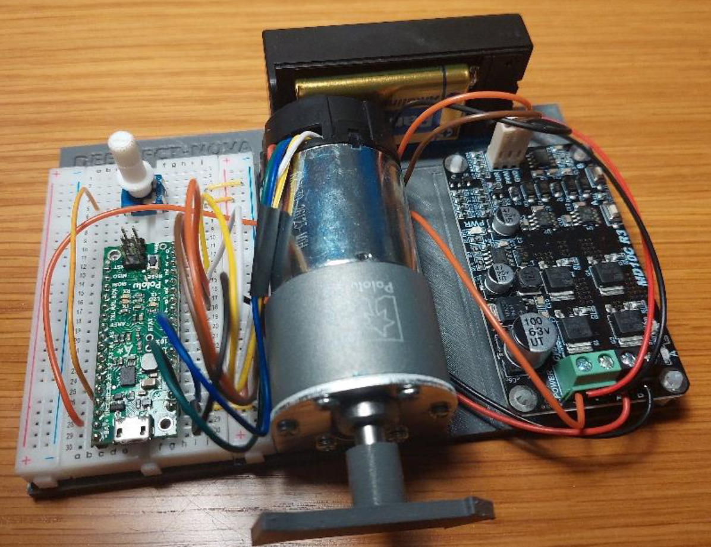
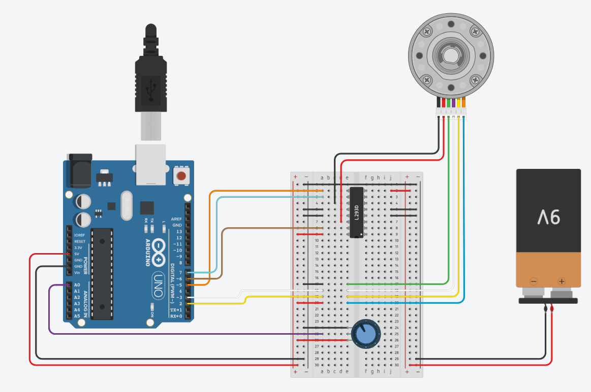

# DC motor position control 

This work is part of a course on Introcuction of Electrical and Computer Engineering, at 
DEEC - NOVA School of Science and Technology, where students are learning for the first time the use of 
feedback dynamic systems, in this case, the difference of a well tuned controller, with no overshoot 
(when A0 is low), or with overshoot (when A0 is maximum).

Author: Bruno Guerreiro (bj.guerreiro@fct.unl.pt)

Acknowledgement: based on https://github.com/curiores/ArduinoTutorials/tree/main/SpeedControl

## List of components

- Arduino Uno, Polulu, or compatible (https://store.arduino.cc/products/arduino-uno-rev3, https://www.pololu.com/product/3104)
- DC Motor with encoder (e.g https://www.pololu.com/product/2824)
- DC Motor driver (e.g. https://www.cytron.io/p-13amp-6v-30v-dc-motor-driver)
- Motor support (e.g. https://www.pololu.com/product/1084)
- 9V battery or 12V dc power adapter
- Wires

## Circuit and Schematics

A photo of the circuit is available below:

A similar circuit is available at [Tinkercad](https://www.tinkercad.com/things/9nTsGPiO9lC-dc-motor-position-control-with-square-wave-reference-v1/editel?sharecode=cfZ7r3N72XNW24HaEOUBCIFMq2eVykIiEbx-aYyWdcg), also presented below:

## Arduino Code

Arduino code is available in folder `MotorControl`, tested with an Arduino UNO and Polulu A* boards.

## 3-D Parts

Some 3-D parts are also available in folder `Parts`, including the base and the arrow, designed in Autodesk Inventor and also available as STL.
